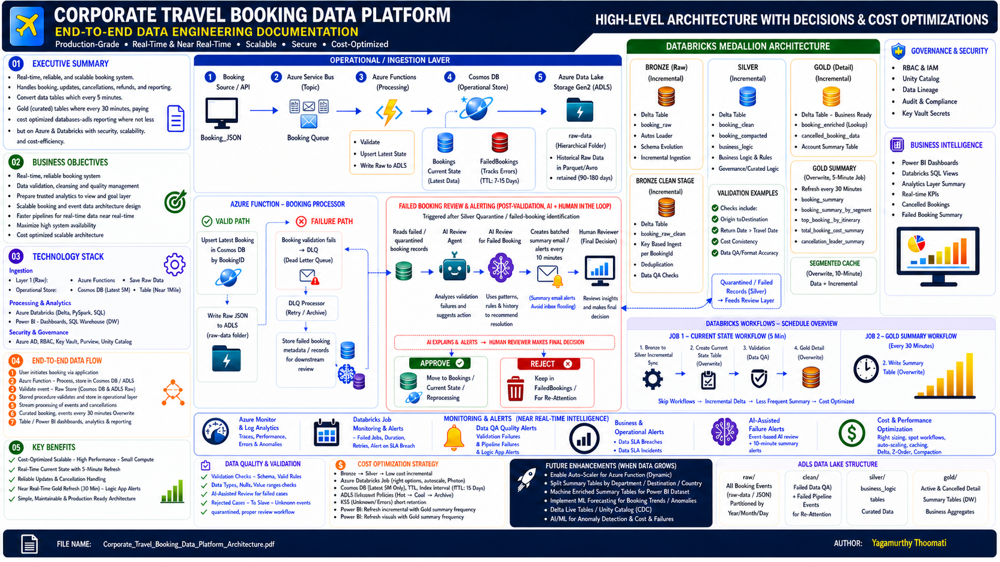
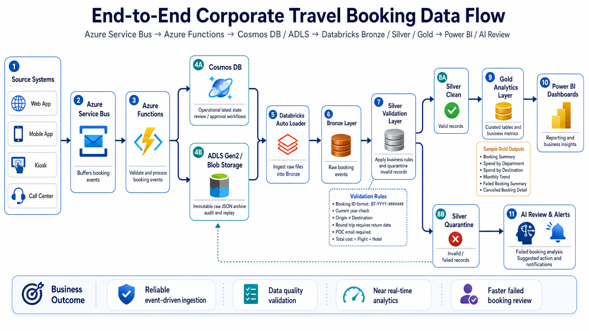

# Corporate Travel Booking Data Platform

## Project Overview

This repository contains a sanitized portfolio version of an end-to-end **Corporate Travel Booking Data Engineering Platform** built using Azure, Databricks, Delta Lake, PySpark, SQL, Power BI, and AI-assisted failed booking review.

The solution is designed to process booking events from multiple source systems, store operational data for fast lookup and review, preserve raw events for audit and replay, apply data quality validations, create curated analytical tables, and support business reporting through Power BI dashboards.

> **Note:** This is a portfolio version of a corporate travel data engineering solution. Project names, resource names, sample data, configuration values, and business identifiers have been anonymized for confidentiality.

---

## Architecture Summary

The platform follows an event-driven and lakehouse-based architecture.

## Architecture Diagrams

### Solution Architecture



### End-to-End Data Flow




```text
Source Systems
    ↓
Azure Service Bus
    ↓
Azure Functions
    ↓
Cosmos DB + ADLS Gen2 / Blob Storage
    ↓
Databricks Auto Loader
    ↓
Bronze Layer
    ↓
Silver Validation Layer
    ↓
Silver Clean / Silver Quarantine
    ↓
Gold Analytics Layer / AI Review & Alerts
    ↓
Power BI Dashboards
```

---

## Technology Stack

| Area | Technology |
|---|---|
| Event Ingestion | Azure Service Bus |
| Processing | Azure Functions with Python |
| Operational Store | Azure Cosmos DB Mongo API |
| Raw Data Storage | Azure Data Lake Storage Gen2 / Blob Storage |
| Data Engineering | Azure Databricks |
| Processing Framework | PySpark |
| Storage Format | Delta Lake |
| Data Architecture | Bronze, Silver, Gold Medallion Architecture |
| Governance | Unity Catalog |
| Reporting | Power BI |
| Monitoring | Azure Monitor, Log Analytics, Databricks Jobs |
| AI Review | AI-assisted failed booking review and summary alerts |

---

## Key Features

- Event-driven booking ingestion using Azure Service Bus
- Azure Functions for booking validation, processing, and routing
- Cosmos DB for operational latest booking state and review workflows
- ADLS Gen2 / Blob Storage for immutable raw JSON archival
- Databricks Auto Loader for incremental raw file ingestion
- Bronze, Silver, and Gold medallion architecture
- Silver-layer validation and quarantine handling
- Gold analytical tables for Power BI reporting
- Cancellation and update handling using latest-event logic
- Failed booking review APIs for approve/reject workflow
- AI-assisted failed booking analysis and scheduled summary alerts
- Cost-aware design using storage lifecycle, TTL, and scheduled workloads

---

## Repository Structure

```text
corporate-travel-data-engineering-platform/
│
├── README.md
├── .gitignore
│
├── architecture/
│   ├── 01-solution-architecture.png
│   └── 02-end-to-end-data-flow.png
│
├── azure-functions/
│   ├── function_app.py
│   ├── requirements.txt
│   ├── host.json
│   ├── local.settings.example.json
│   └── README.md
│
├── databricks-notebooks/
│   ├── 01_bronze_autoloader_ingestion.py
│   ├── 02_bronze_clean_stage.py
│   ├── 03_silver_validation_quarantine.py
│   └── 04_gold_booking_analytics.py
│
├── sql/
│   ├── gold_tables.sql
│   ├── gold_views.sql
│   └── cancellation_views.sql
│
├── sample-data/
│   ├── valid_booking_sample.json
│   ├── invalid_booking_sample.json
│   └── cancelled_booking_sample.json
│
├── powerbi/
│   ├── dashboard_screenshots/
│   └── powerbi_report_notes.md
│
├── ai-review/
│   ├── failed_booking_review_prompt.md
│   └── sample_ai_review_output.json
│
└── docs/
    ├── validation-rules.md
    ├── monitoring-and-alerting.md
    ├── cost-optimization.md
    └── interview-explanation.md
```

---

## End-to-End Data Flow

### 1. Source Systems

Booking events are generated from multiple source channels such as:

- Web application
- Mobile application
- Kiosk
- Call center

Each booking event is sent as a JSON message to Azure Service Bus.

---

### 2. Azure Service Bus

Azure Service Bus is used as a reliable event buffering layer.

It helps with:

- Decoupling source systems from processing logic
- Handling temporary downstream failures
- Supporting retry behavior
- Isolating failed messages using Dead Letter Queue

---

### 3. Azure Functions

Azure Functions process booking messages from Service Bus.

The Function App performs:

- Message parsing
- Initial booking validation
- Latest-state upsert into Cosmos DB
- Raw JSON archival into ADLS / Blob Storage
- Failed booking handling
- Review API support
- Scheduled AI-assisted failed booking alerting

For simplicity, this portfolio version may keep Azure Function triggers and routes in a single `function_app.py` file. In a production codebase, shared validation, Cosmos DB, Blob Storage, and AI review logic can be moved into separate helper modules for better maintainability.

---

### 4. Cosmos DB Operational Layer

Cosmos DB stores the latest operational state of bookings.

It supports:

- Fast booking lookup
- Review and approval workflows
- Failed booking metadata
- Operational current-state queries

Example collections:

```text
Bookings
FailedBookings
```

---

### 5. ADLS Gen2 / Blob Raw Archive

Raw booking events are stored in ADLS Gen2 / Blob Storage for long-term audit and replay.

This layer helps with:

- Immutable raw event storage
- Historical traceability
- Reprocessing support
- Recovery from downstream processing issues

Example folder structure:

```text
raw-data/
└── bookings/
    └── year=2026/
        └── month=05/
            └── day=02/
```

---

## Databricks Medallion Architecture

### Bronze Layer

The Bronze layer stores raw booking events ingested from ADLS using Databricks Auto Loader.

Typical responsibilities:

- Read raw JSON files incrementally
- Capture ingestion timestamp
- Capture source file path
- Support schema evolution
- Preserve raw event structure

Example table:

```text
travel_analytics.bronze.bookings_raw
```

---

### Silver Layer

The Silver layer applies business validations and separates valid and invalid records.

Example valid table:

```text
travel_analytics.silver.bookings_clean
```

Example quarantine table:

```text
travel_analytics.silver.bookings_quarantine
```

---

## Validation Rules

The Silver layer validates bookings using business and data quality rules.

| Rule | Description |
|---|---|
| Booking ID Format | Booking ID should follow `BT-YYYY-########` format |
| Current Year Check | Booking ID year should match the current year |
| Origin / Destination Check | Origin and destination should not be the same |
| Round Trip Rule | Round-trip bookings must have a return date |
| POC Email Rule | POC email is required |
| Cost Consistency | Total cost should equal flight cost plus hotel cost |

Invalid records are moved to the quarantine layer for review and correction.

---

## Gold Analytics Layer

The Gold layer contains curated business-ready tables and views for reporting.

Example Gold outputs:

- Booking summary
- Spend by department
- Spend by destination
- Monthly booking trend
- Failed booking summary
- Cancelled booking detail

Example tables/views:

```text
travel_analytics.gold.booking_summary
travel_analytics.gold.booking_spend_by_department
travel_analytics.gold.booking_spend_by_destination
travel_analytics.gold.booking_monthly_trend
travel_analytics.gold.failed_booking_summary
travel_analytics.gold.cancelled_booking_detail
```

---

## Power BI Reporting

Power BI connects to the Gold layer through Databricks SQL Warehouse or SQL views.

Dashboard examples:

- Total valid bookings
- Average booking cost
- Spend by department
- Spend by destination
- Monthly booking trend
- Failed booking summary
- Cancelled booking details

---

## Failed Booking Review and AI Alerts

Failed or quarantined records are reviewed through a downstream review workflow.

The AI-assisted review layer is not part of Service Bus directly. It belongs to the failed booking review and alerting layer after failed records are identified.

The review process includes:

1. Failed or quarantined booking records are identified
2. AI review logic analyzes validation failures
3. Suggested action is generated
4. Summary alert is created for reviewers
5. Human reviewer makes the final decision
6. Approved records can be corrected/reprocessed
7. Rejected records can be archived or removed based on retention policy

Example AI review output:

```json
{
  "failure_summary": "Booking ID format is invalid and origin matches destination.",
  "failed_rules": [
    "Invalid bookingId format",
    "Origin and destination cannot be same"
  ],
  "suggested_action": "MANUAL_REVIEW",
  "business_explanation": "The booking requires manual validation because both identifier and route details are inconsistent.",
  "confidence": 0.91
}
```

---

## Monitoring and Alerting

The platform can be monitored using:

- Azure Monitor
- Log Analytics
- Azure Function logs
- Databricks job run history
- Service Bus dead-letter monitoring
- Power BI refresh monitoring
- AI-assisted failed booking summary alerts

Example monitoring areas:

- Function execution failures
- Service Bus message backlog
- DLQ message count
- Databricks job failures
- Silver quarantine count
- Gold refresh status
- Failed booking alert summary

---

## Cost Optimization Strategy

The solution includes multiple cost optimization considerations:

- Service Bus decoupling to avoid source-system retry pressure
- Cosmos DB TTL for short-term operational failed records
- ADLS lifecycle management for older raw data
- Databricks scheduled jobs instead of always-on clusters
- Incremental processing where suitable
- Gold summary refresh based on business reporting needs
- Power BI reporting from curated Gold views instead of raw data

---

## Security and Confidentiality

This repository does not include:

- Real connection strings
- Azure access keys
- SAS tokens
- Client secrets
- Real employee data
- Real booking records
- Internal company documents
- Real project or client names

Configuration values are represented using placeholders and environment variables.

Example:

```python
CosmosDBConnection = os.environ["CosmosDBConnection"]
ServiceBusConnection = os.environ["ServiceBusConnection"]
```

---

## Sample Environment Configuration

Use `local.settings.example.json` as a template.

```json
{
  "IsEncrypted": false,
  "Values": {
    "AzureWebJobsStorage": "<storage-connection-string>",
    "FUNCTIONS_WORKER_RUNTIME": "python",
    "ServiceBusConnection": "<service-bus-connection-string>",
    "CosmosDBConnection": "<cosmos-db-mongo-connection-string>",
    "BlobStorageConnection": "<blob-storage-connection-string>"
  }
}
```

Do not upload real `local.settings.json` to GitHub.

---

## Business Value

This platform provides:

- Reliable event-driven ingestion
- Better data quality through validation and quarantine
- Faster operational review of failed bookings
- Trusted analytics for business reporting
- Near real-time visibility into booking trends and failures
- Scalable architecture for growing booking volumes
- Clear separation between operational processing and analytical reporting

---

## End-to-End Workflow Summary

A short explanation of the project:

> This project demonstrates an end-to-end Azure data engineering platform for corporate travel booking events. Source systems send booking messages to Azure Service Bus. Azure Functions process the events, update the latest operational state in Cosmos DB, and archive raw JSON in ADLS. Databricks Auto Loader ingests raw files into the Bronze layer. Silver applies business validations and separates clean and quarantined records. Gold creates curated business tables and views for Power BI reporting. Failed bookings are reviewed through an AI-assisted alerting and human approval workflow.

---

## Disclaimer

This project is for portfolio and learning purposes. It is a sanitized implementation inspired by real-world data engineering patterns. All names, data, resource identifiers, and configuration values are anonymized.
